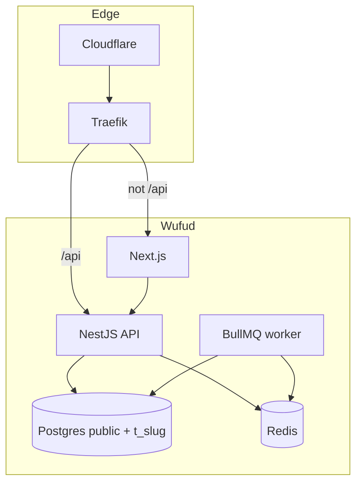

# Wufud - Hajj & Umrah Package Booking System

Wufūd (وفود) is the Arabic plural for "delegations" or "envoys,". Wufūd means groups of representatives, ambassadors, or delegations sent by various tribes to meet a leader or ruler.
This repository is a schema-per-tenant Hajj and Umrah booking SaaS: NestJS + MikroORM on PostgreSQL, Next.js on Tailwind 4, Traefik at the edge.

## Stack

- Backend: NestJS, MikroORM 6, PostgreSQL 17, Redis / BullMQ, Argon2, JWT
- Frontend: Next.js, React 19, Tailwind 4, Urbanist, TanStack Query
- Isolation: `public` platform schema + `t_<slug>` per tenant
- Payments: SSLCommerz, Stripe Checkout, stub (local), manual branch POS
- Access: branch-scoped RBAC from a single `User` model


## Local setup

```bash
cp .env.local.example .env.local
pnpm install
docker compose -f docker-compose.local.yml up -d postgres redis mailpit
# Full stack (installs deps in a Docker volume, runs migrations + seed, then dev):
# docker compose -f docker-compose.local.yml up -d
# Build production images + bring up stack + smoke checks:
# ./scripts/docker-local-test.sh

pnpm --filter @wufud/contracts build
pnpm migrate:public
pnpm seed:demo
pnpm dev # runs the API and frontend together
```

Visit:

- Platform: [http://wufud.localhost:3009](http://wufud.localhost:3009) (and [http://localhost:3009](http://localhost:3009))
- Demo agency: [http://demo.wufud.localhost:3009](http://demo.wufud.localhost:3009)
- API health: [http://localhost:4005/api/v1/health](http://localhost:4005/api/v1/health) (legacy `/api/health` still works)
- OpenAPI (Swagger): [http://localhost:4005/api/docs](http://localhost:4005/api/docs) — every endpoint is versioned as `/api/v1/...` with a short description plus example request/response; use **Authorize** with a Bearer token from `POST /api/v1/auth/login`.
- Mailpit: [http://localhost:8025](http://localhost:8025)

`*.localhost` resolves to 127.0.0.1 without a hosts file.

Local compose publishes Postgres on `55432`, Redis on `56379`, the API on `4005`, and the frontend on `3009` so they can sit beside other stacks. Match those in `.env.local` (see `.env.local.example`).

## Host-specific experiences

Keep both services running with `pnpm dev`: the frontend resolves each host through the backend at `localhost:4005`.

- `wufud.localhost:3009`: Wufud platform marketing and the navy platform console at `/admin`.
- `demo.wufud.localhost:3009`: Nur Travels storefront, pilgrim registration, and agency operations at `/dashboard`.
- Agency names and branding come from `/api/public/context`; tenant pages do not fall back to platform marketing when the API is unavailable.
- Sign in with each account on its matching hostname. Workspace navigation respects tenant features and user permissions.

With the seeded database and both servers running, verify the live host routing and admin experiences:

```bash
CI=1 PLAYWRIGHT_BASE_URL=http://wufud.localhost:3009 pnpm --filter frontend exec playwright test e2e/tenancy.spec.ts e2e/acceptance.spec.ts --workers=1
```


## Demo accounts

Password: `WufudDemo!2026` (override with `DEMO_PASSWORD`)


| Role                 | Email                                                   |
| -------------------- | ------------------------------------------------------- |
| Platform superadmin  | [admin@wufud.local](mailto:admin@wufud.local)           |
| Tenant admin         | [owner@demo.local](mailto:owner@demo.local)             |
| Branch manager (CTG) | [manager.ctg@demo.local](mailto:manager.ctg@demo.local) |
| Agent                | [agent@demo.local](mailto:agent@demo.local)             |
| Pilgrim              | [pilgrim@demo.local](mailto:pilgrim@demo.local)         |


## Design answers

**How do we prevent overselling under concurrent bookings?** 

Creation locks the package-tier row (`SELECT … FOR UPDATE`), checks availability, and creates the booking/hold plus increments `seats_held` in one transaction. PostgreSQL also enforces `seats_confirmed + seats_held <= seats_total`. Confirmation, cancellation, and expiry use row locks; late receipts never resurrect released seats. PostgreSQL integration tests race bookings for the last seat and concurrent hold expiry.

**How do we handle duplicate or out-of-order payment webhooks?** 

The attempt row is locked; a successful attempt is immutable and its receipt/booking update commits in the same transaction. Verified success can supersede a failed/cancelled redirect. Provider validation checks amount, currency, and transaction/session identity; untrusted session IDs cannot replace the checkout session. Transaction IDs now use 96 random bits. Tenant event receipts are informational: retries rely on attempt state, not a pre-inserted event ID. Recommended next steps: authenticated webhook ingress (Stripe signatures), a durable inbox/outbox with retry/reconciliation, and provider validation outside database locks with a locked recheck before committing.


**How would we keep reporting fast at 5 million users?** 

Summary totals now aggregate in PostgreSQL with pre-grouped joins, avoiding full financial-table hydration and quadratic JavaScript scans; archived financial records remain included. Keyset lists and daily snapshots already exist, but summary requests still scan tenant history and return all tier quotas—this is not a demonstrated five-million-user design. Add incremental tenant/branch/day rollups, tenant- and permission-scoped caching, paginated quotas, and asynchronous exports; use read replicas or an analytics store for heavy/cross-tenant reporting. Validate indexes and partitioning against query plans and representative load tests; shard tenants across databases when one database reaches measured limits.


The stub gateway is disabled in staging/production. Deployment startup now rejects default, short, or identical JWT signing secrets in staging/production. Set distinct `JWT_ACCESS_SECRET` and `JWT_REFRESH_SECRET` values of at least 32 characters before deploying.

## Assumptions and trade-offs

- Booking/POS collections use BDT. Gateway currency must match the booking; branch cash payments use recorder/approver separation.
- Pilgrims are tenant users with the `pilgrim` system role.
- Tenant base currency is BDT; vendor costs record SAR + FX + BDT equivalent.
- Local email goes through Mailpit. Custom domains write Traefik’s file provider.
- NestJS 11 and MikroORM 6 are used.


## Diagrams


### High Level Design




Request: Host → PlatformDomain or `slug.wufud…` or verified Domain → AsyncLocalStorage tenant store → MikroORM `em.schema = t_slug`.

### Entity Relationship Diagram

```mermaid
erDiagram
    %% ── Public Schema Relationships ────────────────────────────
    Tenant ||--o{ Domain : "has domains"
    Tenant ||--o{ User : "has members"
    Tenant ||--o{ TenantSubscription : "billed via"
    Tenant ||--o{ TenantFeatureOverride : "feature overrides"
    Plan ||--o{ TenantSubscription : "covers"
    Plan ||--o{ AgencySignup : "chosen plan"
    TenantSubscription ||--o{ SubscriptionInvoice : "invoiced"
    User ||--o{ PlatformUserRole : "platform access"
    PlatformRole ||--o{ PlatformUserRole : "assigned to"
    PlatformRole ||--o{ PlatformRolePermission : "grants"

    %% ── Tenant Schema: Access Relationships ────────────────────
    Role ||--o{ RolePermission : "grants"
    Role ||--o{ UserRole : "assigned to"
    Branch ||--o{ UserRole : "scopes"

    %% ── Tenant Schema: Booking Relationships ───────────────────
    TravelPackage ||--o{ PackageTier : "has tiers"
    TravelPackage }o--o| Branch : "belongs to"
    PackageTier ||--o{ Booking : "booked under"
    PackageTier ||--o{ SeatHold : "holds seats"
    Booking ||--o{ BookingPilgrim : "has pilgrims"
    Booking ||--o{ SeatHold : "reserves via"
    Booking ||--o{ InstallmentPlan : "may have"
    Booking ||--o{ Payment : "receives"
    Booking ||--o{ ManualPayment : "receives manual"
    Booking ||--o{ Cancellation : "cancelled via"
    Booking ||--o{ RefundRequest : "refund claims"
    Booking }o--o| Branch : "originated at"
    InstallmentPlan ||--o{ Installment : "schedule"
    ManualPayment }o--o| Branch : "recorded at"

    %% ── Tenant Schema: Accounts Relationships ──────────────────
    Vendor ||--o{ VendorDisbursement : "receives"
    VendorDisbursement }o--o| Booking : "for booking"
    StockItem ||--o{ StockIssue : "issued as"
    StockItem ||--o{ PosSale : "sold via (lines)"
    StockIssue }o--o| Booking : "issued to"
    SettlementReport ||--o{ ReconciliationItem : "contains"

    %% ── Tenant Schema: Payments Relationships ──────────────────
    PaymentGatewayCatalog ||--o{ TenantGatewayInstance : "enabled as"

    %% ── Public Schema Entities ─────────────────────────────────
    Tenant {
        uuid id PK
        string name
        string slug "UK"
        string schemaName "UK"
        string status "active|trial|suspended|cancelled"
        boolean isEnabled
        string plan "nullable"
        json features "nullable"
        int maxUsers
        int maxBranches
        int maxRoles
        string ownerEmail "nullable"
        string timezone
        string currency
        string locale
        int version
    }

    Domain {
        uuid id PK
        uuid tenant_id FK
        string domain "UK"
        boolean isPrimary
        string verificationToken "nullable"
        timestamp verifiedAt "nullable"
    }

    User {
        uuid id PK
        uuid tenant_id FK "nullable"
        string email "nullable, UK"
        string phone "nullable"
        string fullName
        boolean emailVerified
        timestamp passwordSetAt "nullable"
        timestamp lastLogin "nullable"
    }

    Plan {
        uuid id PK
        string name
        string slug "UK"
        text description "nullable"
        decimal priceMonthly
        string currency
        json features
        int maxUsers
        int maxBranches
        int sortOrder
        int trialDays
        int invitationExpiresHours
    }

    AgencySignup {
        uuid id PK
        uuid plan_id FK
        string agencyName
        string slug
        string ownerEmail
        string ownerFullName
        string mode "trial|paid"
        string status "pending|provisioned|failed|expired"
        string gatewaySlug "nullable"
        string tranId "nullable"
        uuid tenantId "nullable"
        string verifyTokenHash "nullable"
        timestamp verificationExpiresAt "nullable"
    }

    TenantSubscription {
        uuid id PK
        uuid tenant_id FK
        uuid plan_id FK
        string status "trialing|active|past_due|cancelled"
        timestamp currentPeriodStart
        timestamp currentPeriodEnd
    }

    SubscriptionInvoice {
        uuid id PK
        uuid subscription_id FK
        decimal amount
        string currency
        string status "open|paid|void"
        timestamp paidAt "nullable"
    }

    TenantFeatureOverride {
        uuid id PK
        uuid tenant_id FK
        string featureKey
        boolean enabled
    }

    PlatformRole {
        uuid id PK
        string name
        string slug "UK"
        boolean isSystem
        string color "nullable"
    }

    PlatformRolePermission {
        uuid id PK
        uuid role_id FK
        string moduleKey
        string permissionLevel "none|view|edit|full"
    }

    PlatformUserRole {
        uuid id PK
        uuid userId FK "references User"
        uuid role_id FK
        uuid assignedById "nullable"
    }

    PaymentGatewayCatalog {
        uuid id PK
        string slug "UK"
        string name
        text description "nullable"
        boolean isEnabledForTenants
        json configSchema
        boolean isSandbox
        boolean isDefault
        int sortOrder
    }

    %% ── Tenant Schema: Access Entities ─────────────────────────
    Branch {
        uuid id PK
        string name
        string code "UK"
        boolean isHeadquarters
        string status "active|maintenance|opening_soon|closed"
        uuid managerId "nullable"
        string address "nullable"
        string city "nullable"
        string phone "nullable"
        string email "nullable"
    }

    Role {
        uuid id PK
        string name
        string slug "UK"
        string description "nullable"
        boolean isSystem
        string color "nullable"
    }

    RolePermission {
        uuid id PK
        uuid role_id FK
        string featureKey
        string permissionLevel "none|view|edit|full"
    }

    UserRole {
        uuid id PK
        uuid userId FK "references User"
        uuid role_id FK
        uuid branch_id FK "nullable"
        string userEmail "nullable"
        string assignedByEmail "nullable"
    }

    %% ── Tenant Schema: Booking Entities ────────────────────────
    TravelPackage {
        uuid id PK
        uuid branch_id FK "nullable"
        string name
        string kind "hajj|ramadan_umrah|offseason_umrah|ziyarah"
        text description "nullable"
        date departureDate
        timestamp bookingOpensAt
        timestamp bookingClosesAt
        int durationDays
        int maxPilgrims
        string makkahHotel "nullable"
        string madinahHotel "nullable"
        string airline "nullable"
        string flightRoute "nullable"
        json inclusions "nullable"
        json itinerary "nullable"
        boolean featured
        string bannerImage "nullable"
    }

    PackageTier {
        uuid id PK
        uuid package_id FK
        string name
        decimal price
        string currency
        int seatsTotal
        int seatsConfirmed
        int seatsHeld
        string roomType "nullable"
        json features "nullable"
    }

    Booking {
        uuid id PK
        uuid userId FK "references User"
        uuid tier_id FK
        uuid branch_id FK "nullable"
        string status "draft|held|confirmed|defaulted|cancelled"
        decimal frozenPrice
        string currency
        int pilgrimCount
        string paymentMode "full|installment"
        decimal amountReceived
        timestamp holdExpiresAt "nullable"
    }

    BookingPilgrim {
        uuid id PK
        uuid booking_id FK
        string fullName
        string passportNumber
        string nationality "nullable"
        date dateOfBirth "nullable"
        boolean cancelled
    }

    SeatHold {
        uuid id PK
        uuid tier_id FK
        uuid booking_id FK
        int seats
        timestamp expiresAt
        boolean isOpen
    }

    InstallmentPlan {
        uuid id PK
        uuid booking_id FK
        decimal downPayment
    }

    Installment {
        uuid id PK
        uuid plan_id FK
        int sequence
        date dueDate
        decimal amountDue
        decimal amountPaid
        decimal amountWaived
        string status "open|paid|overdue|defaulted"
    }

    Cancellation {
        uuid id PK
        uuid booking_id FK
        decimal chargeAmount
        text reason "nullable"
        boolean isPartial
    }

    RefundRequest {
        uuid id PK
        uuid booking_id FK
        decimal amount
        string status "requested|approved|processing|paid|rejected"
        uuid approvedById FK "references User, nullable"
        text note "nullable"
    }

    %% ── Tenant Schema: Accounts & Payments Entities ────────────
    Payment {
        uuid id PK
        uuid booking_id FK
        string source "gateway|manual"
        decimal amount
        string currency
        string gatewaySlug "nullable"
        string tranId "nullable"
    }

    ManualPayment {
        uuid id PK
        uuid booking_id FK
        uuid branch_id FK "nullable"
        string requestKey "UK, nullable"
        decimal amount
        string method "cash|card|bkash|nagad|bank_transfer"
        uuid recordedById FK "references User"
        uuid approvedById FK "references User, nullable"
        string status "pending|approved|rejected"
        json receipt "nullable"
    }

    TenantGatewayInstance {
        uuid id PK
        string gatewaySlug "UK"
        boolean isSandbox
        boolean isGatewayActive
        boolean isDefault
    }

    Vendor {
        uuid id PK
        string name
        string kind "hotel|airline|transport|visa|other"
        string contact "nullable"
    }

    VendorDisbursement {
        uuid id PK
        uuid vendor_id FK
        uuid booking_id FK "nullable"
        decimal amountSar
        decimal fxRate
        decimal amountBdt
        text note "nullable"
    }

    StockItem {
        uuid id PK
        string name
        string kind "product|service"
        decimal salePrice
        int quantity
        decimal unitCost
    }

    StockIssue {
        uuid id PK
        uuid item_id FK
        uuid booking_id FK "nullable"
        int quantity
        decimal costBdt
        uuid reversalOf FK "reversal, nullable"
    }

    PosSale {
        uuid id PK
        string requestKey "UK"
        decimal total
        string status "paid|refunded"
        json lines
        json receipt "nullable"
        json refundReceipt "nullable"
    }

    SettlementReport {
        uuid id PK
        string gatewaySlug
        timestamp periodStart
        timestamp periodEnd
        string status "open|reconciled"
    }

    ReconciliationItem {
        uuid id PK
        uuid report_id FK
        string tranId "nullable"
        decimal gatewayAmount
        decimal internalAmount "nullable"
        string status "matched|mismatch|resolved"
        text note "nullable"
    }
```




Every table uses a UUID v7 primary key. Soft-delete lives on `BaseEntity`. Payment attempts and webhook events are hard-delete only.

See details explanations on [docs/HLD.md](docs/HLD.md) and [docs/ERD.md](docs/ERD.md).

## Compose files


| File                         | Use                               |
| ---------------------------- | --------------------------------- |
| `docker-compose.local.yml`   | Dev with bind mounts              |
| `docker-compose.test.yml`    | Ephemeral Postgres/Redis for CI   |
| `docker-compose.staging.yml` | GHCR images behind Traefik        |
| `docker-compose.prod.yml`    | Same as staging, production hosts |


## License

See [LICENSE](LICENSE).

## Business-rule audit and Accounts workspaces

See [business rules, feature migration, assumptions and verification](docs/BUSINESS_RULES.md). Accounts now has independently gated pages, and `/dashboard/pos` supports product/service cash sales and sale refunds. Run `pnpm migrate:tenants` before starting the updated app.