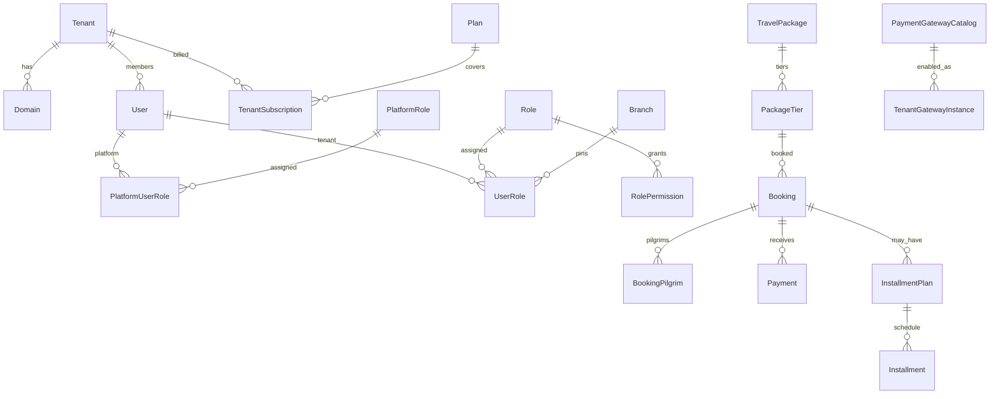

# Entity-relationship diagram

```mermaid
erDiagram
  Tenant ||--o{ Domain : has
  Tenant ||--o{ User : members
  Tenant ||--o{ TenantSubscription : billed
  Plan ||--o{ TenantSubscription : covers
  User ||--o{ PlatformUserRole : platform
  PlatformRole ||--o{ PlatformUserRole : assigned
  User ||--o{ UserRole : tenant
  Role ||--o{ UserRole : assigned
  Role ||--o{ RolePermission : grants
  Branch ||--o{ UserRole : pins
  TravelPackage ||--o{ PackageTier : tiers
  PackageTier ||--o{ Booking : booked
  Booking ||--o{ BookingPilgrim : pilgrims
  Booking ||--o{ Payment : receives
  Booking ||--o{ InstallmentPlan : may_have
  InstallmentPlan ||--o{ Installment : schedule
  PaymentGatewayCatalog ||--o{ TenantGatewayInstance : enabled_as
```

Every table uses a UUID v7 primary key. Soft-delete lives on `BaseEntity`. Payment attempts and webhook events are hard-delete only.
