# Entity-relationship diagram

```mermaid
erDiagram
    %% ── Public Schema Relationships ────────────────────────────
    Tenant ||--o{ Domain : "has domains"
    Tenant ||--o{ User : "has members"
    Tenant ||--o{ TenantSubscription : "billed via"
    Tenant ||--o{ TenantFeatureOverride : "feature overrides"
    Plan ||--o{ TenantSubscription : "covers"
    Plan ||--o{ AgencySignup : "chosen plan"
    TenantSubscription ||--o{ SubscriptionInvoice : "invoiced"
    User ||--o{ PlatformUserRole : "platform access"
    PlatformRole ||--o{ PlatformUserRole : "assigned to"
    PlatformRole ||--o{ PlatformRolePermission : "grants"

    %% ── Tenant Schema: Access Relationships ────────────────────
    Role ||--o{ RolePermission : "grants"
    Role ||--o{ UserRole : "assigned to"
    Branch ||--o{ UserRole : "scopes"

    %% ── Tenant Schema: Booking Relationships ───────────────────
    TravelPackage ||--o{ PackageTier : "has tiers"
    TravelPackage }o--o| Branch : "belongs to"
    PackageTier ||--o{ Booking : "booked under"
    PackageTier ||--o{ SeatHold : "holds seats"
    Booking ||--o{ BookingPilgrim : "has pilgrims"
    Booking ||--o{ SeatHold : "reserves via"
    Booking ||--o{ InstallmentPlan : "may have"
    Booking ||--o{ Payment : "receives"
    Booking ||--o{ ManualPayment : "receives manual"
    Booking ||--o{ Cancellation : "cancelled via"
    Booking ||--o{ RefundRequest : "refund claims"
    Booking }o--o| Branch : "originated at"
    InstallmentPlan ||--o{ Installment : "schedule"
    ManualPayment }o--o| Branch : "recorded at"

    %% ── Tenant Schema: Accounts Relationships ──────────────────
    Vendor ||--o{ VendorDisbursement : "receives"
    VendorDisbursement }o--o| Booking : "for booking"
    StockItem ||--o{ StockIssue : "issued as"
    StockItem ||--o{ PosSale : "sold via (lines)"
    StockIssue }o--o| Booking : "issued to"
    SettlementReport ||--o{ ReconciliationItem : "contains"

    %% ── Tenant Schema: Payments Relationships ──────────────────
    PaymentGatewayCatalog ||--o{ TenantGatewayInstance : "enabled as"

    %% ── Public Schema Entities ─────────────────────────────────
    Tenant {
        uuid id PK
        string name
        string slug "UK"
        string schemaName "UK"
        string status "active|trial|suspended|cancelled"
        boolean isEnabled
        string plan "nullable"
        json features "nullable"
        int maxUsers
        int maxBranches
        int maxRoles
        string ownerEmail "nullable"
        string timezone
        string currency
        string locale
        int version
    }

    Domain {
        uuid id PK
        uuid tenant_id FK
        string domain "UK"
        boolean isPrimary
        string verificationToken "nullable"
        timestamp verifiedAt "nullable"
    }

    User {
        uuid id PK
        uuid tenant_id FK "nullable"
        string email "nullable, UK"
        string phone "nullable"
        string fullName
        boolean emailVerified
        timestamp passwordSetAt "nullable"
        timestamp lastLogin "nullable"
    }

    Plan {
        uuid id PK
        string name
        string slug "UK"
        text description "nullable"
        decimal priceMonthly
        string currency
        json features
        int maxUsers
        int maxBranches
        int sortOrder
        int trialDays
        int invitationExpiresHours
    }

    AgencySignup {
        uuid id PK
        uuid plan_id FK
        string agencyName
        string slug
        string ownerEmail
        string ownerFullName
        string mode "trial|paid"
        string status "pending|provisioned|failed|expired"
        string gatewaySlug "nullable"
        string tranId "nullable"
        uuid tenantId "nullable"
        string verifyTokenHash "nullable"
        timestamp verificationExpiresAt "nullable"
    }

    TenantSubscription {
        uuid id PK
        uuid tenant_id FK
        uuid plan_id FK
        string status "trialing|active|past_due|cancelled"
        timestamp currentPeriodStart
        timestamp currentPeriodEnd
    }

    SubscriptionInvoice {
        uuid id PK
        uuid subscription_id FK
        decimal amount
        string currency
        string status "open|paid|void"
        timestamp paidAt "nullable"
    }

    TenantFeatureOverride {
        uuid id PK
        uuid tenant_id FK
        string featureKey
        boolean enabled
    }

    PlatformRole {
        uuid id PK
        string name
        string slug "UK"
        boolean isSystem
        string color "nullable"
    }

    PlatformRolePermission {
        uuid id PK
        uuid role_id FK
        string moduleKey
        string permissionLevel "none|view|edit|full"
    }

    PlatformUserRole {
        uuid id PK
        uuid userId FK "references User"
        uuid role_id FK
        uuid assignedById "nullable"
    }

    PaymentGatewayCatalog {
        uuid id PK
        string slug "UK"
        string name
        text description "nullable"
        boolean isEnabledForTenants
        json configSchema
        boolean isSandbox
        boolean isDefault
        int sortOrder
    }

    %% ── Tenant Schema: Access Entities ─────────────────────────
    Branch {
        uuid id PK
        string name
        string code "UK"
        boolean isHeadquarters
        string status "active|maintenance|opening_soon|closed"
        uuid managerId "nullable"
        string address "nullable"
        string city "nullable"
        string phone "nullable"
        string email "nullable"
    }

    Role {
        uuid id PK
        string name
        string slug "UK"
        string description "nullable"
        boolean isSystem
        string color "nullable"
    }

    RolePermission {
        uuid id PK
        uuid role_id FK
        string featureKey
        string permissionLevel "none|view|edit|full"
    }

    UserRole {
        uuid id PK
        uuid userId FK "references User"
        uuid role_id FK
        uuid branch_id FK "nullable"
        string userEmail "nullable"
        string assignedByEmail "nullable"
    }

    %% ── Tenant Schema: Booking Entities ────────────────────────
    TravelPackage {
        uuid id PK
        uuid branch_id FK "nullable"
        string name
        string kind "hajj|ramadan_umrah|offseason_umrah|ziyarah"
        text description "nullable"
        date departureDate
        timestamp bookingOpensAt
        timestamp bookingClosesAt
        int durationDays
        int maxPilgrims
        string makkahHotel "nullable"
        string madinahHotel "nullable"
        string airline "nullable"
        string flightRoute "nullable"
        json inclusions "nullable"
        json itinerary "nullable"
        boolean featured
        string bannerImage "nullable"
    }

    PackageTier {
        uuid id PK
        uuid package_id FK
        string name
        decimal price
        string currency
        int seatsTotal
        int seatsConfirmed
        int seatsHeld
        string roomType "nullable"
        json features "nullable"
    }

    Booking {
        uuid id PK
        uuid userId FK "references User"
        uuid tier_id FK
        uuid branch_id FK "nullable"
        string status "draft|held|confirmed|defaulted|cancelled"
        decimal frozenPrice
        string currency
        int pilgrimCount
        string paymentMode "full|installment"
        decimal amountReceived
        timestamp holdExpiresAt "nullable"
    }

    BookingPilgrim {
        uuid id PK
        uuid booking_id FK
        string fullName
        string passportNumber
        string nationality "nullable"
        date dateOfBirth "nullable"
        boolean cancelled
    }

    SeatHold {
        uuid id PK
        uuid tier_id FK
        uuid booking_id FK
        int seats
        timestamp expiresAt
        boolean isOpen
    }

    InstallmentPlan {
        uuid id PK
        uuid booking_id FK
        decimal downPayment
    }

    Installment {
        uuid id PK
        uuid plan_id FK
        int sequence
        date dueDate
        decimal amountDue
        decimal amountPaid
        decimal amountWaived
        string status "open|paid|overdue|defaulted"
    }

    Cancellation {
        uuid id PK
        uuid booking_id FK
        decimal chargeAmount
        text reason "nullable"
        boolean isPartial
    }

    RefundRequest {
        uuid id PK
        uuid booking_id FK
        decimal amount
        string status "requested|approved|processing|paid|rejected"
        uuid approvedById FK "references User, nullable"
        text note "nullable"
    }

    %% ── Tenant Schema: Accounts & Payments Entities ────────────
    Payment {
        uuid id PK
        uuid booking_id FK
        string source "gateway|manual"
        decimal amount
        string currency
        string gatewaySlug "nullable"
        string tranId "nullable"
    }

    ManualPayment {
        uuid id PK
        uuid booking_id FK
        uuid branch_id FK "nullable"
        string requestKey "UK, nullable"
        decimal amount
        string method "cash|card|bkash|nagad|bank_transfer"
        uuid recordedById FK "references User"
        uuid approvedById FK "references User, nullable"
        string status "pending|approved|rejected"
        json receipt "nullable"
    }

    TenantGatewayInstance {
        uuid id PK
        string gatewaySlug "UK"
        boolean isSandbox
        boolean isGatewayActive
        boolean isDefault
    }

    Vendor {
        uuid id PK
        string name
        string kind "hotel|airline|transport|visa|other"
        string contact "nullable"
    }

    VendorDisbursement {
        uuid id PK
        uuid vendor_id FK
        uuid booking_id FK "nullable"
        decimal amountSar
        decimal fxRate
        decimal amountBdt
        text note "nullable"
    }

    StockItem {
        uuid id PK
        string name
        string kind "product|service"
        decimal salePrice
        int quantity
        decimal unitCost
    }

    StockIssue {
        uuid id PK
        uuid item_id FK
        uuid booking_id FK "nullable"
        int quantity
        decimal costBdt
        uuid reversalOf FK "reversal, nullable"
    }

    PosSale {
        uuid id PK
        string requestKey "UK"
        decimal total
        string status "paid|refunded"
        json lines
        json receipt "nullable"
        json refundReceipt "nullable"
    }

    SettlementReport {
        uuid id PK
        string gatewaySlug
        timestamp periodStart
        timestamp periodEnd
        string status "open|reconciled"
    }

    ReconciliationItem {
        uuid id PK
        uuid report_id FK
        string tranId "nullable"
        decimal gatewayAmount
        decimal internalAmount "nullable"
        string status "matched|mismatch|resolved"
        text note "nullable"
    }
```

---

## Architectural & Modeling Rules

1. **Primary Keys & BaseEntity Lifecycle**:
   - Every table uses a **UUID v7** primary key (`id`).
   - Tables extending `BaseEntity` include standard lifecycle and soft-delete attributes: `createdAt`, `updatedAt`, `createdBy`, `updatedBy`, `deletedBy`, `isActive`, `isPublished`, `isDeleted`, and `deletedAt`.
   - Join and immutable log tables (`PlatformUserRole`, `RolePermission`, `UserRole`, `TenantFeatureOverride`, `ReconciliationItem`, `PaymentAttempt`, `WebhookEvent`, `DailyBookingStat`) extend `UuidEntity` and do not have soft-delete columns.

2. **Cross-Schema References**:
   - Platform schema is `public`; tenant schemas are isolated as `t_<slug>`.
   - Foreign keys do not cross PostgreSQL schema boundaries directly: cross-schema references (e.g. `Booking.userId` and `UserRole.userId` pointing to `User.id` in `public`, or `TenantGatewayInstance.gatewaySlug` pointing to `PaymentGatewayCatalog.slug`) are maintained as UUID / string keys validated at the application layer.

3. **Invariants & Safety**:
   - **PackageTier**: Seat integrity enforced via `CHECK (seats_confirmed + seats_held <= seats_total)` with pessimistic row locking (`SELECT … FOR UPDATE`) during checkout.
   - **Booking**: Price is frozen at creation (`frozenPrice`), not at payment/confirmation time.
   - **ManualPayment**: Maker-checker policy requires `recordedById != approvedById`.
   - **Idempotency**: Unique keys on `payment_attempts.tranId`, `manual_payments.requestKey`, `pos_sales.requestKey`, and `webhook_events.providerEventId`.

---

## Data Dictionary / Attribute Reference

### 1. Public Schema (`public`)

| Entity | Table | Key Attributes | Notes & Invariants |
|---|---|---|---|
| **Tenant** | `tenants` | `id` (PK), `name`, `slug` (UK), `schemaName` (UK), `status`, `isEnabled`, `plan`, `features` (JSON), `maxUsers`, `maxBranches`, `maxRoles`, `ownerEmail`, `currency`, `timezone`, `locale` | Root tenant record mapped to schema `t_<slug>`. |
| **Domain** | `domains` | `id` (PK), `tenant_id` (FK), `domain` (UK), `isPrimary`, `verificationToken`, `verifiedAt` | Custom domain routing for agency storefronts. |
| **User** | `users` | `id` (PK), `tenant_id` (FK nullable), `email` (UK nullable), `phone`, `fullName`, `emailVerified`, `passwordHash`, `lastLogin` | Platform and tenant users; tenant is null for platform superadmins. |
| **Plan** | `plans` | `id` (PK), `name`, `slug` (UK), `description`, `priceMonthly`, `currency`, `features` (JSON), `maxUsers`, `maxBranches`, `trialDays` | SaaS subscription plans defining feature tiers and quotas. |
| **AgencySignup** | `agency_signups` | `id` (PK), `plan_id` (FK), `agencyName`, `slug`, `ownerEmail`, `ownerFullName`, `passwordHash`, `mode` (`trial\|paid`), `status`, `gatewaySlug`, `tranId`, `tenantId` | Self-service registration & provisioning queue. |
| **TenantSubscription** | `tenant_subscriptions` | `id` (PK), `tenant_id` (FK), `plan_id` (FK), `status` (`trialing\|active\|past_due\|cancelled`), `currentPeriodStart`, `currentPeriodEnd` | Active subscription periods for billing. |
| **SubscriptionInvoice** | `subscription_invoices` | `id` (PK), `subscription_id` (FK), `amount`, `currency`, `status` (`open\|paid\|void`), `paidAt` | Platform billing invoices generated per billing cycle. |
| **TenantFeatureOverride** | `tenant_feature_overrides` | `id` (PK), `tenant_id` (FK), `featureKey`, `enabled` | Granular per-tenant feature overrides over plan defaults. |
| **PlatformRole** | `platform_roles` | `id` (PK), `name`, `slug` (UK), `isSystem`, `color` | Superadmin RBAC role definitions. |
| **PlatformRolePermission** | `platform_role_permissions` | `id` (PK), `role_id` (FK), `moduleKey`, `permissionLevel` (`none\|view\|edit\|full`) | Module-level access rights for platform roles. |
| **PlatformUserRole** | `platform_user_roles` | `id` (PK), `userId` (FK to User), `role_id` (FK), `assignedById` | Assigns platform roles to users. |
| **PaymentGatewayCatalog** | `payment_gateway_catalog` | `id` (PK), `slug` (UK), `name`, `isEnabledForTenants`, `configSchema` (JSON), `platformCredentials` (JSON hidden), `isSandbox`, `isDefault` | Global payment gateways supported by the platform (Stripe, SSLCommerz). |

### 2. Tenant Schema (`t_<slug>`) — Access Control

| Entity | Table | Key Attributes | Notes & Invariants |
|---|---|---|---|
| **Branch** | `branches` | `id` (PK), `name`, `code` (UK), `isHeadquarters`, `status` (`active\|maintenance\|opening_soon\|closed`), `managerId`, `address`, `city`, `phone`, `email` | Agency branches scoping bookings, packages, and staff. |
| **Role** | `roles` | `id` (PK), `name`, `slug` (UK), `description`, `isSystem`, `color` | Custom and preset tenant agency roles (`admin`, `manager`, `accountant`, etc.). |
| **RolePermission** | `role_permissions` | `id` (PK), `role_id` (FK), `featureKey`, `permissionLevel` (`none\|view\|edit\|full`) | Feature-flag permissions granted to a role. |
| **UserRole** | `user_roles` | `id` (PK), `userId` (FK to User), `role_id` (FK), `branch_id` (FK nullable), `userEmail`, `assignedByEmail` | Staff role assignment scoped optionally to a specific branch. |

### 3. Tenant Schema (`t_<slug>`) — Booking & Pilgrims

| Entity | Table | Key Attributes | Notes & Invariants |
|---|---|---|---|
| **TravelPackage** | `packages` | `id` (PK), `branch_id` (FK nullable), `name`, `kind` (`hajj\|ramadan_umrah\|offseason_umrah\|ziyarah`), `departureDate`, `bookingOpensAt`, `bookingClosesAt`, `durationDays`, `maxPilgrims`, `makkahHotel`, `madinahHotel`, `airline`, `flightRoute`, `inclusions` (JSON), `itinerary` (JSON), `featured`, `bannerImage` | Package master record. |
| **PackageTier** | `package_tiers` | `id` (PK), `package_id` (FK), `name`, `price`, `currency`, `seatsTotal`, `seatsConfirmed`, `seatsHeld`, `roomType`, `features` (JSON) | Pricing tier with seat limits. `seats_confirmed + seats_held <= seats_total`. |
| **Booking** | `bookings` | `id` (PK), `userId` (FK to User), `tier_id` (FK), `branch_id` (FK nullable), `status` (`draft\|held\|confirmed\|defaulted\|cancelled`), `frozenPrice`, `currency`, `pilgrimCount`, `paymentMode` (`full\|installment`), `amountReceived`, `holdExpiresAt` | Pilgrim booking record. Hold duration enforced via BullMQ background jobs. |
| **BookingPilgrim** | `booking_pilgrims` | `id` (PK), `booking_id` (FK), `fullName`, `passportNumber`, `nationality`, `dateOfBirth`, `cancelled` | Individual pilgrim traveler profiles attached to a booking. |
| **SeatHold** | `seat_holds` | `id` (PK), `tier_id` (FK), `booking_id` (FK), `seats`, `expiresAt`, `isOpen` | Temporary seat hold during checkout flow before final confirmation. |
| **InstallmentPlan** | `installment_plans` | `id` (PK), `booking_id` (FK), `downPayment` | Payment schedule for installment-based bookings. |
| **Installment** | `installments` | `id` (PK), `plan_id` (FK), `sequence`, `dueDate`, `amountDue`, `amountPaid`, `amountWaived`, `status` (`open\|paid\|overdue\|defaulted`) | Milestone payment scheduled prior to departure date. |
| **Cancellation** | `cancellations` | `id` (PK), `booking_id` (FK), `chargeAmount`, `reason`, `isPartial` | Cancellation log capturing penalty charge amounts. |
| **RefundRequest** | `refund_requests` | `id` (PK), `booking_id` (FK), `amount`, `status` (`requested\|approved\|processing\|paid\|rejected`), `approvedById`, `note` | Multi-step refund workflow capped against gross received payments. |

### 4. Tenant Schema (`t_<slug>`) — Accounts, POS & Financial Operations

| Entity | Table | Key Attributes | Notes & Invariants |
|---|---|---|---|
| **Payment** | `payments` | `id` (PK), `booking_id` (FK), `source` (`gateway\|manual`), `amount`, `currency`, `gatewaySlug`, `tranId` | Successful online or applied manual payment. |
| **ManualPayment** | `manual_payments` | `id` (PK), `booking_id` (FK), `branch_id` (FK nullable), `requestKey` (UK), `amount`, `method` (`cash\|card\|bkash\|nagad\|bank_transfer`), `recordedById`, `approvedById`, `status` (`pending\|approved\|rejected`), `receipt` (JSON) | Offline cash/transfer payments requiring maker-checker approval (`recordedById != approvedById`). |
| **TenantGatewayInstance** | `tenant_gateway_instances` | `id` (PK), `gatewaySlug` (UK), `credentials` (JSON hidden), `isSandbox`, `isGatewayActive`, `isDefault` | Tenant-specific credentials for configured gateways. |
| **Vendor** | `vendors` | `id` (PK), `name`, `kind` (`hotel\|airline\|transport\|visa\|other`), `contact` | Third-party suppliers (hotels in Makkah/Madinah, airlines, transport providers). |
| **VendorDisbursement** | `vendor_disbursements` | `id` (PK), `vendor_id` (FK), `booking_id` (FK nullable), `amountSar`, `fxRate`, `amountBdt`, `note` | Disbursements recorded in SAR with foreign exchange conversion to BDT base currency. |
| **StockItem** | `stock_items` | `id` (PK), `name`, `kind` (`product\|service`), `salePrice`, `quantity`, `unitCost` | Inventory items (Ihram, Zamzam, bags, SIM cards) or ancillary services. |
| **StockIssue** | `stock_issues` | `id` (PK), `item_id` (FK), `booking_id` (FK nullable), `quantity`, `costBdt`, `reversalOf` (UK nullable) | Stock deductions assigned to pilgrims or sold at retail. |
| **PosSale** | `pos_sales` | `id` (PK), `requestKey` (UK), `total`, `status` (`paid\|refunded`), `lines` (JSON), `receipt` (JSON), `refundReceipt` (JSON) | Point of Sale retail transactions with itemized JSON lines. |
| **SettlementReport** | `settlement_reports` | `id` (PK), `gatewaySlug`, `periodStart`, `periodEnd`, `status` (`open\|reconciled`) | Gateway payout settlement batch reports. |
| **ReconciliationItem** | `reconciliation_items` | `id` (PK), `report_id` (FK), `tranId`, `gatewayAmount`, `internalAmount`, `status` (`matched\|mismatch\|resolved`), `note` | Itemized gateway reconciliation comparison records. |

### 5. Standalone & Log Entities

| Entity | Schema | Table | Key Attributes | Notes |
|---|---|---|---|---|
| **PaymentAttempt** | `t_<slug>` | `payment_attempts` | `id` (PK), `tranId` (UK), `gatewaySlug`, `amount`, `currency`, `status` (`init\|pending\|success\|failed\|cancelled`), `sourceRef`, `valId`, `gatewayResponse` (JSON), `validatedAt` | Immutable attempt audit log (hard-delete only). |
| **PlatformPaymentAttempt** | `public` | `platform_payment_attempts` | `id` (PK), `tranId` (UK), `gatewaySlug`, `amount`, `currency`, `status`, `sourceRef`, `valId`, `gatewayResponse` (JSON), `validatedAt` | Attempt log for platform agency subscription checkouts. |
| **WebhookEvent** | `t_<slug>` | `webhook_events` | `id` (PK), `providerEventId` (UK), `gatewaySlug`, `payload` (JSON), `createdAt` | Inbound IPN/webhook idempotency log (hard-delete only). |
| **CancellationRule** | `t_<slug>` | `cancellation_rules` | `id` (PK), `daysBeforeDeparture`, `chargePercent` | Tenant-wide cancellation policy tiers. |
| **Expense** | `t_<slug>` | `expenses` | `id` (PK), `title`, `amount`, `currency`, `category` | General agency operating expenses (rent, utilities, salaries). |
| **DailyBookingStat** | `t_<slug>` | `daily_booking_stats` | `id` (PK), `day`, `branchId`, `bookingsCount`, `collected`, `outstanding` | Aggregated daily reporting snapshots. |
| **TenantSettings** | `t_<slug>` | `tenant_settings` | `id` (PK), `displayName`, `logoUrl`, `primaryColor`, `title`, `description`, `ogImageUrl`, `keywords`, `currency` | Tenant storefront metadata and branding. |
| **AuditLog** | `t_<slug>` | `audit_logs` | `id` (PK), `actorId`, `action`, `targetType`, `targetId`, `metadata` (JSON) | Security and mutation audit trail for agency operations. |
| **PlatformAuditLog** | `public` | `platform_audit_logs` | `id` (PK), `actorId`, `action`, `targetType`, `targetId`, `metadata` (JSON) | Audit trail for platform superadmin operations. |
| **Asset** | `public` | `assets` | `id` (PK), `url`, `mimeType`, `originalFilename`, `altText`, `sizeBytes` | Uploaded media and documents stored on CDN/S3. |
| **AssetRelation** | `t_<slug>` | `asset_relations` | `id` (PK), `assetId`, `parentType`, `parentId`, `role`, `fieldName`, `sortOrder`, `isPrimary` | Polymorphic attachment linking `Asset` to packages, pilgrims, or receipts. |
| **Invitation** | `public` | `invitations` | `id` (PK), `email`, `fullName`, `tokenHash`, `type` (`employee\|tenant_owner\|platform`), `expiresAt`, `acceptedAt`, `tenantId`, `invitedById` | Tokenized team and owner invitations. |
