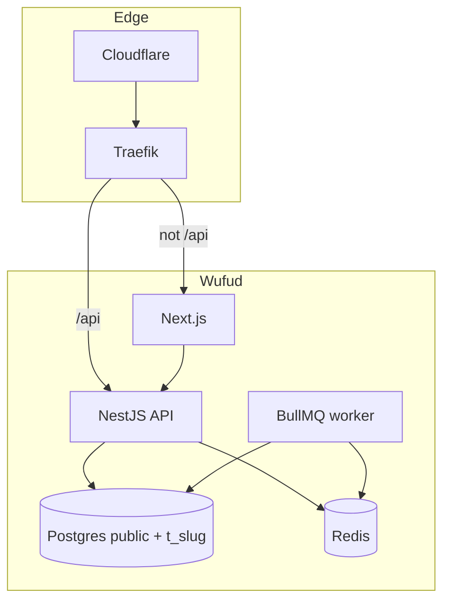

# High-level design

```mermaid
flowchart TB
  subgraph edge [Edge]
    CF[Cloudflare]
    TR[Traefik]
  end
  subgraph app [Wufud]
    FE[Next.js]
    BE[NestJS API]
    WK[BullMQ worker]
    PG[(Postgres public + t_slug)]
    RD[(Redis)]
  end
  CF --> TR
  TR -->|not /api| FE
  TR -->|/api| BE
  FE --> BE
  BE --> PG
  BE --> RD
  WK --> PG
  WK --> RD
```

Request: Host → PlatformDomain or `slug.wufud…` or verified Domain → AsyncLocalStorage tenant store → MikroORM `em.schema = t_slug`.
